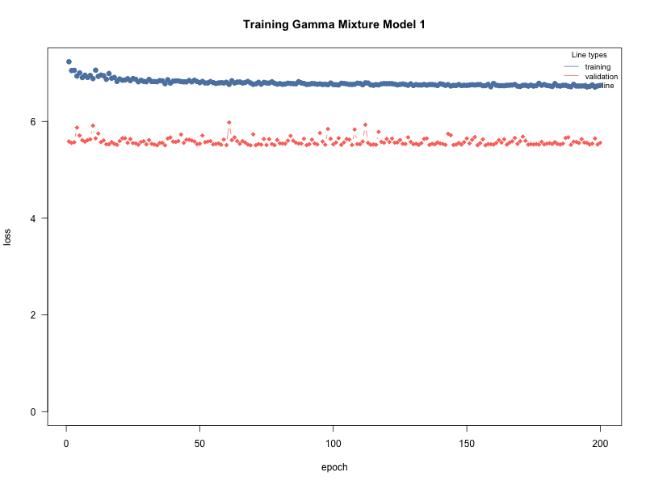
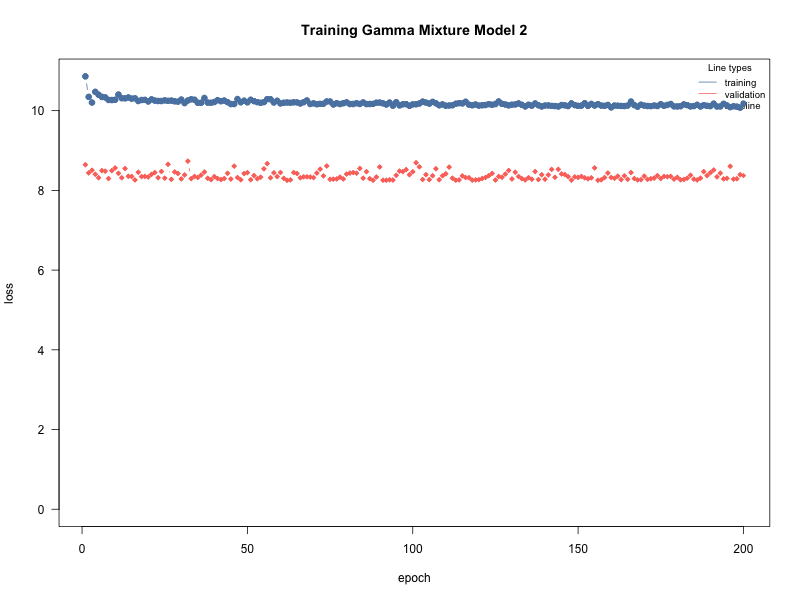
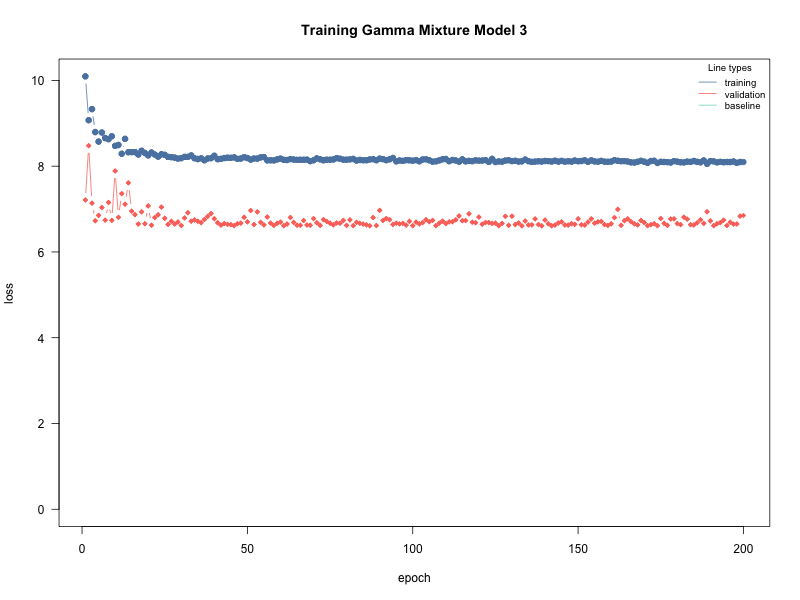
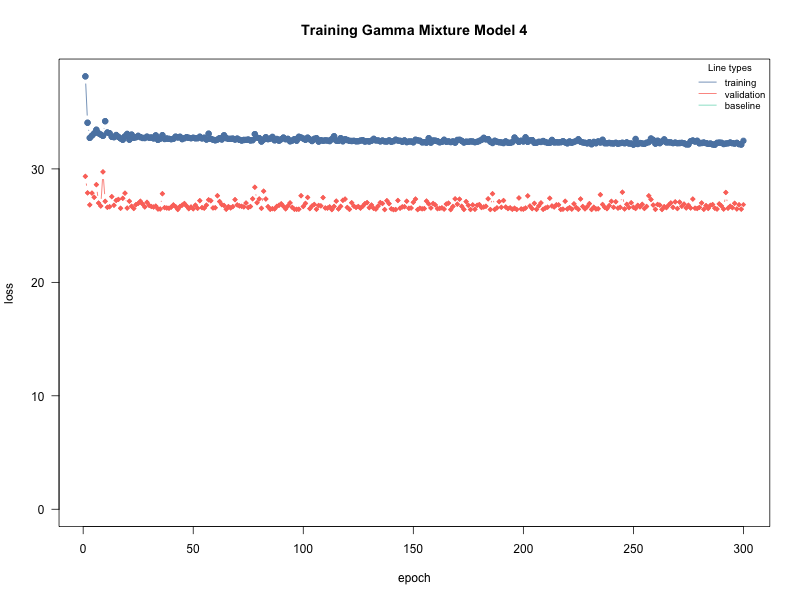

#| echo: true    # show code
#| eval: false   # do not run code
#| include: false # run code but hide code and output


@lst-libraries-loaded

[libraries](#lst-libraries-loaded)

```{R, eval=FALSE, echo=TRUE}
#| lst-label: lst-libraries-loaded
#| lst-cap: "Loaded Libraries"

knitr::opts_chunk$set(echo = TRUE)
library(cito)
library(torch)
library(lubridate) #library(SPQR) is also loaded

```


@lst-load-dataset-and-explore-it

[Exploration](#lst-load-dataset-and-explore-it)

```{R, eval=FALSE, echo=TRUE}
#| lst-label: lst-load-dataset-and-explore-it
#| lst-cap: "load dataset and explore it"

weather <- readRDS("weather.RDS")
dim(weather)
str(weather)
maxt <- max(weather$time)
mint <- min(weather$time)

maxt
mint

trange = maxt - mint

maxtmax <- max(weather$tmax)
mintmax <- min(weather$tmax)
maxtmax
mintmax

maxpr <- max(weather$pr)
minpr <- min(weather$pr)
maxpr
minpr
```


@lst-Select-a-June-only-subset

[Subset](#lst-Select-a-June-only-subset)


```{R, eval=FALSE, echo=TRUE}
#| lst-label: lst-Select-a-June-only-subset
#| lst-cap: "Select a June only subset"

data <- weather[weather$month == 6, ]
dim(data)
head(data)
```

@lst-Kelvin-to-Celsius

[Subset](#lst-Kelvin-to-Celsius)

```{R, eval=FALSE, echo=TRUE}
#| lst-label: lst-Kelvin-to-Celsius
#| lst-cap: "Convert temperature values from Kelvin (K) to degrees Celsius (°C)"
data$tmax <- data$tmax - 273.15
str(data)
```


@lst-pr-to-0

[resulting subset dataset](#lst-pr-to-0)


```{R, eval=FALSE, echo=TRUE}
#| lst-label: lst-pr-to-0
#| lst-cap: "Set all precipitation values less than 0.01 to 0"
data$pr[data$pr < 0.01] <- 0
str(data)
```

The resulting subset dataset contains 48,000 observations and 7 variables.

@lst-training-testing-sets-split

[Subset](#lst-training-testing-sets-split)

```{R, eval=FALSE, echo=TRUE}
#| lst-label: lst-training-testing-sets-split
#| lst-cap: "training/testing sets split"
train_rows <- which(year(data$time) > 1960 & year(data$time) < 2001)
train_set <- data[train_rows, ]
test_set <- data[-train_rows, ]

dim(train_set)
head(train_set)

dim(test_set)
head(test_set)
```

We split the subset dataset into training and testing sets, we will use the data from 1961 to 2000 as the training set and the data from 1951 to 1960 and 2001 to 2014 as the testing set. The training set contains 30,000 observations, while the testing set contains 18,000 observations. 

The true split is as follows: 

    - Training set: 30,000 / 48,000 = 0.625 = 62.5%
    - Testing set: 18,000 / 48,000 = 0.375 = 37.5% 

This split is approximatly 60% for training and 40% for testing, allowing us to train our model on a substantial amount of data while reserving a significant portion for evaluating its performance on unseen data. 


**2. Custom Loss Function for semi-continuous gamma mixture:**

Now that our dataset is ready for analysis, we define a custom loss function for a semi-continuous gamma mixture model. This loss function will be used to fit the model to the training data and evaluate its performance on the testing data.

- The Loss Function for semi-continuous gamma mixture model:


Taking into account the mixture model:

$$Y\ |\ X, \theta \sim \ \pi_0 \ + \ (1 - \pi_0)Gamma(\alpha, \beta)$$

Here, $\theta = (\pi_0, \alpha, \beta)$, hence the parameters to be estimated were $\pi_0$, $\alpha$ and $\beta$. Here, $\pi_0$ represents the probability that it will not rain, whereas the $Gamma$ distribution portion of the formula models precipitation in terms of temperature if it rains. $\alpha$ and $\beta$ are parameters of the $Gamma$ distribution, relevant for estimating the mean precipitation.

Importantly, the $Gamma$ portion of the formula is only relevant if it rains, hence the log-likelihood function must correctly account for that. The log-likelihood function is thus:

$$
l(\theta|Y) =
\begin{cases}
\sum_{i:y_i=0} \log(\pi_{0i}) & \text{if } y_i = 0 \\ 
\sum_{i:y_i>0} \left[\log(1-\pi_{0i}) + \log\{Gamma(y_i; \alpha_i, \beta_i)\}\right] & \text{if } y_i > 0
\end{cases}
$$


@lst-Loss-Function

[Loss Function](#lst-Loss-Function)

```{R, eval=FALSE, echo=TRUE}
#| lst-label: lst-Loss-Function
#| lst-cap: "Calculate the Loss Function"
set.seed(007)
GSCMM_nll <- function(pred,true,...){
  yobs <- true[,1, drop = FALSE] # Extract Observed precipitation values
  rainy <- ifelse(yobs > 0, 1, 0) # Create a binary variable indicating whether it rained or not
  
  pi0 <- torch_sigmoid(pred[, 1, drop = FALSE]) # Extract the predicted probability of no rain
  alpha <- torch_exp(pred[, 2, drop = FALSE]) + 1e-6 # Extract the predicted shape parameter for the gamma distribution
  beta <- torch_exp(pred[, 3, drop = FALSE]) + 1e-6 # Extract the predicted rate parameter for the gamma distribution
  
  alpha <- alpha[rainy == 1] # Keep only the shape parameters for the rainy days
  beta <- beta[rainy == 1] # Keep only the scale parameters for the rainy days

# Log-likelihood split into two parts
# The first for non-rainy days, the second for rainy days

  ll <- sum(torch_log(pi0[rainy == 0])) +
        sum(torch_log(1 - pi0[rainy == 1]) + torch::distr_gamma(alpha,beta)$log_prob(yobs[rainy == 1])) # Calculate the log-likelihood for the semi-continuous gamma mixture model
  # Return the negative log-likelihood, which is the loss that will be minimized during model fitting
  return(-ll) # Return the negative log-likelihood.
}
```

The script for this custom loss function takes in the predicted values and the true values, and calculates the negative log-likelihood for the semi-continuous gamma mixture model. The function first extracts the observed precipitation values and creates a binary variable indicating whether it rained or not. It then extracts the predicted probability of no rain, as well as the predicted shape and rate parameters for the gamma distribution. Finally, it calculates the log-likelihood for the semi-continuous gamma mixture model and returns its negative value, which is equal to (-ll) the loss that will be minimized during model fitting.
:::

:::{.callout-note collapse="true"}

## Part 2: Model Fitting

**1. Fitting a model for pr | tmax:**

 In this second part of the project, we fit a model for precipitation as a function of maximum temperature at a location of our choice which we decided to be location 1. This subsetting operation resulted in a training dataframe with 1,200 observations and a testing dataframe with 720 observations. This number of observations may be small, but it is sufficient to fit a model for our analysis. We will use the training dataframe to fit the model and the testing dataframe to evaluate its performance. The results may not be as accurate as if we had used the entire dataset, but they will still provide valuable insights into the relationship between maximum temperature and precipitation.
 


@lst-location-1-subset

[location 1 subset](#lst-location-1-subset)

```{R, eval=FALSE, echo=TRUE}
#| lst-label: lst-location-1-subset
#| lst-cap: "location 1 subset"

train_loc1 <- train_set[train_set$loc == 1, ]
test_loc1 <- test_set[test_set$loc == 1, ]
dim(train_loc1)
dim(test_loc1)


train_df <- data.frame(x = train_loc1$tmax, y = train_loc1$pr)
test_df <- data.frame(x = test_loc1$tmax, y = test_loc1$pr)

dim(train_df)
dim(test_df)
```

We decided to fit multiple neural network models for the semi-continuous gamma mixture model, combining different values for the number of hidden layers, the number of neurons in each layer, the epochs, and the batchsize. After experimenting with hundreds of combinations we selected the 4 moust reliable models and run some more experiments to refine our experiment.


@lst-models-fit

[models](#lst-models-fit)

```{R, eval=FALSE, echo=TRUE}
#| lst-label: lst-models-fit
#| lst-cap: "Models 1, 2, 3, and 4 Fitting"

# | fig-high: 12
# | fig-width: 6


par(mfrow = c(1, 1))

save_training_plot <- function(fit, filename, title) {
  png(filename, width = 800, height = 600)
  on.exit(dev.off(), add = TRUE)
  cito:::visualize.training(
    losses = fit$losses,
    epoch = nrow(fit$losses),
    main = title,
    new = TRUE
  )
}

# Model 1:
set.seed(007)
torch::torch_manual_seed(007)
model1 <- cito::dnn(
  cbind(y,y,y) ~ x, data = train_df, loss = GSCMM_nll,
  hidden = c(50, 50), activation = "relu",
  epochs = 200, lr = 0.001, batchsize = 12,
  optimizer = "adam", validation = 0.2,
  verbose = F, plot = FALSE
  )
cito:::visualize.training(
    losses = model1$losses,
    epoch = nrow(model1$losses),
    main = "Training Gamma Mixture Model 1",
    new = TRUE
)
save_training_plot(model1, "model1_training_plot.png", "Training Gamma Mixture Model 1")


# Model 2:
set.seed(007)
torch::torch_manual_seed(007)
model2 <- cito::dnn(
  cbind(y,y,y) ~ x, data = train_df, loss = GSCMM_nll,
  hidden = c(50, 50, 50), activation = "relu",
  epochs = 200, lr = 0.001, batchsize = 15,
  optimizer = "adam", validation = 0.2,
  verbose = F, plot = FALSE
  )
cito:::visualize.training(
    losses = model2$losses,
    epoch = nrow(model2$losses),
    main = "Training Gamma Mixture Model 2",
    new = TRUE
)
save_training_plot(model2, "model2_training_plot.png", "Training Gamma Mixture Model 2")

# Model 3:
set.seed(007)
torch::torch_manual_seed(007)
model3 <- cito::dnn(
  cbind(y,y,y) ~ x, data = train_df, loss = GSCMM_nll,
  hidden = c(100, 100), activation = "relu",
  epochs = 200, lr = 0.001, batchsize = 12,
  optimizer = "adam", validation = 0.2,
  verbose = F, plot = FALSE
  )
cito:::visualize.training(
    losses = model3$losses,
    epoch = nrow(model3$losses),
    main = "Training Gamma Mixture Model 3",
    new = TRUE
)
save_training_plot(model3, "model3_training_plot.png", "Training Gamma Mixture Model 3")


# Model 4:
set.seed(007)
torch::torch_manual_seed(007)
model4 <- cito::dnn(
  cbind(y,y,y) ~ x, data = train_df, loss = GSCMM_nll,
  hidden = c(100, 100, 100), activation = "relu",
  epochs = 300, lr = 0.001, batchsize = 50,
  optimizer = "adam", validation = 0.2,
  verbose = F, plot = FALSE
  )
cito:::visualize.training(
    losses = model4$losses,
    epoch = nrow(model4$losses),
    main = "Training Gamma Mixture Model 4",
    new = TRUE
)
save_training_plot(model4, "model4_training_plot.png", "Training Gamma Mixture Model 4")
```

Using the log-likelihood, we evaluated all four fitted models on the testing set. Because each model is evaluated on the same testing set, the best model is the one with the largest test-set log-likelihood, which is equivalent to the smallest test-set negative log-likelihood.

To identify the best model, we focused on two criteria: 

1. Overfitting/Underfitting behavior during training, as indicated by the training and validation loss curves. 

In this step, we used the training and validation loss curves to assess the model's performance during training. We looked for models that had a small gap between the training and validation loss, indicating that the model was not overfitting or underfitting the data. A model that is overfitting will have a low training loss but a high validation loss, while a model that is underfitting will have both high training and validation losses. We selected models that had a small gap between the two losses, indicating that they were able to generalize well to unseen data.

2. The model with the lowest validation loss (negative log-likelihood) during training. 

Regarding the validation loss, we selected the model that had the lowest validation loss during training. This indicates that the model was able to generalize well to unseen data and was not overfitting or underfitting the training data. We also looked at the test-set log-likelihood to confirm that the selected model performed well on the testing set.

The best model was selected based on the combination of these two criteria, and it was used for the subsequent analysis in Part 3 and Part 4 of the project.


@lst-Best-Model

[Best Model](#lst-Best-Model)

```{R, eval=FALSE, echo=TRUE}
#| lst-label: lst-Best-Model
#| lst-cap: "Picking the Best Model"

set.seed(007)
models <- list(
  model1 = list(fit = model1, hidden_layers = 2, neurons = 50, epochs = 200, batchsize = 12),
  model2 = list(fit = model2, hidden_layers = 3, neurons = 50, epochs = 200, batchsize = 10),
  model3 = list(fit = model3, hidden_layers = 2, neurons = 100, epochs = 210, batchsize = 10),
  model4 = list(fit = model4, hidden_layers = 3, neurons = 100, epochs = 200, batchsize = 10)
)

calc_test_log_likelihood <- function(fit, data) {
  raw_pred <- predict(fit, newdata = data, type = "link")
  y <- data$y

  pi0 <- plogis(raw_pred[, 1])
  pi0 <- pmin(pmax(pi0, .Machine$double.eps), 1 - .Machine$double.eps)

  alpha <- exp(pmax(pmin(raw_pred[, 2], 50), -50))
  beta <- exp(pmax(pmin(raw_pred[, 3], 50), -50))

  log_lik <- numeric(length(y))
  dry <- y == 0
  rainy <- y > 0

  log_lik[dry] <- log(pi0[dry])
  log_lik[rainy] <- log1p(-pi0[rainy]) +
    dgamma(y[rainy], shape = alpha[rainy], rate = beta[rainy], log = TRUE)

  sum(log_lik)
}

model_selection <- do.call(rbind, lapply(names(models), function(m) {
  fit <- models[[m]]$fit
  losses <- fit$losses

  data.frame(
    model = m,
    hidden_layers = models[[m]]$hidden_layers,
    neurons_per_layer = models[[m]]$neurons,
    epochs = models[[m]]$epochs,
    batchsize = models[[m]]$batchsize,
    min_training_nll = min(losses$train_l, na.rm = TRUE),
    min_validation_nll = min(losses$valid_l, na.rm = TRUE),
    best_epoch = losses$epoch[which.min(losses$valid_l)],
    test_log_likelihood = calc_test_log_likelihood(fit, test_df)
  )
}))

model_selection$test_nll <- -model_selection$test_log_likelihood
model_selection$mean_test_nll <- model_selection$test_nll / nrow(test_df)
model_selection <- model_selection[order(model_selection$test_nll), ]
rownames(model_selection) <- NULL

best_model <- model_selection[1, ]
best_model_name <- best_model$model
best_model_fit <- models[[best_model_name]]$fit
model <- best_model_fit

selection_sentence <- sprintf(
  paste0(
    "The best model is %s, with %s hidden layers, %s neurons per layer, ",
    "%s epochs, and a batch size of %s. It was selected because it had ",
    "the smallest test-set negative log-likelihood (%.2f), which means ",
    "it assigned the highest probability to the observed precipitation ",
    "values in the testing set."
  ),
  best_model$model,
  best_model$hidden_layers,
  best_model$neurons_per_layer,
  best_model$epochs,
  best_model$batchsize,
  best_model$test_nll
)

knitr::kable(
  model_selection,
  digits = 3,
  caption = "Model comparison using test-set log-likelihood. Models are ranked from best to worst by test negative log-likelihood."
)
```

r selection_sentence` This fitted model is used for the validation plots and scientific questions below.


:::

:::{.callout-note collapse="true"}

## Part 3: Model Validation

To evaluate the model's ability to predict whether it will rain or not (the probability of not raining $\pi_0$), the observations in the testing set with precipitation superior to 0 were coded as 1, while the others were left as 0. $\pi_0$ predictions for each data point in the testing set were obtained and plotted in a histogram.

**1. Predicting whether it rains:**


@lst-Predict-Rain

[Predictions](#lst-Predict-Rain)

```{R, eval=FALSE, echo=TRUE}
#| lst-label: lst-Predict-Rain
#| lst-cap: "Predict Rain"

#| echo: false
#| fig-cap: "Figure 2 - Histogram for the probability of not raining."
# Converting the testing set to a binary variable for rain (1) and no rain (0)
set.seed(007)
binary_rain_data <- test_df
binary_rain_data$y[binary_rain_data$y != 0] <- 1

# Estimate pi0 (probability of not raining) using the best model selected in Part 2
raw_pred <- predict(best_model_fit, newdata = binary_rain_data)
pi0_hat <- plogis(raw_pred[, 1])
histogram <- hist(pi0_hat, main = "Probability of not raining", xlab = "Probability of not raining", ylab = "Frequency", col = "lightblue", border = "black")

png("histogram_training_plot.png", width = 800, height = 600)
histtogram
dev.off()
```

The estimates of $\pi_0$ are concentrated around very high values, which agrees with the observation that in most days in the testing set it did not rain.

To assess the model numerically, we used the Brier score, defined by the formula

$$BS = \frac{1}{n}\sum_{i=1}^n(f_i-o_i)^2$$ where $f_i$ is the predicted probability, $o_i$ is the actual outcome (0 or 1) and n is the dataset size. In this case, n is the testing set size, which is 720.

@lst-Brier-Score

[Brier Score](#lst-Brier-Score)


```{R, eval=FALSE, echo=TRUE}
#| lst-label: lst-Brier-Score
#| lst-cap: "The Brier Score"
# Brier Score
# The probability of raining (1 - pi_0) is expected to be pretty low, as most data points are 0
Brier_Score = mean(((1-pi0_hat) - binary_rain_data$y)^2)
print(Brier_Score)
```

The Brier Score estimate was r Brier_Score`, which is a relatively small value, indicating that the model performs reasonably well in predicting whether it will rain or not.

**2. Predicting the amount of rainfall:**

Conversely, to evaluate how well the model predicted the amount of rain in the days that rainfall was observed, we first subset the testing set to only rainy days.

We proceeded to calculate the mean rainfall from the $\alpha$ and $\beta$ parameters of the $Gamma$ distribution, per the following formula:

$$\mu = \frac{\alpha}{\beta}$$ These mean values were then plotted against the actual observed rainfall values:

@fig-Rainfall-mean-True-mean
@lst-Rainfall-mean-True-mean

[calculate](#lst-Rainfall-mean-True-mean)

```{R, eval=FALSE, echo=TRUE}
#| lst-label: lst-Rainfall-mean-True-mean
#| lst-cap: "Estimated rainfall means vs true means"
#| fig-cap: "Figure 3 - Estimated rainfall means vs true means."
set.seed(007)
#Subset for rainy days (y different from 0)
rain_test <- test_df[binary_rain_data$y != 0,]

rain_pred <- predict(best_model_fit, newdata = rain_test)

alpha <- exp(rain_pred[,2])
beta <- exp(rain_pred[,3])

# Precipitation estimates
est_means <- alpha/beta

# True precipitation means
true_means <- rain_test$y

plot(true_means,est_means,pch=20, 
     xlab = "True means",
     ylab = "Estimated means")
```

The model seems to perform generally well considering that the larger values in the x-axis are few and sparse, with the larger cloud of points indicating a general agreement between predicted and real values, with the larger values exhibiting outlying behavior.

The root mean-squared error (RMSE) was used to diagnose the model's ability to predict the amount of rainfall. The RMSE is calculated via the following formula:

$$RMSE = \sqrt{\frac{1}{n}\sum(y_i-\hat{y_i})^2}$$ where $y_i$ are the observed values and $\hat{y_i}$ are the predicted values for rainfall, in this case.


@lst-RMSE

[RMSE](#lst-RMSE)

```{R, eval=FALSE, echo=TRUE}
#| lst-label: lst-RMSE
#| lst-cap: "Root Mean Square Error"

set.seed(007)
RMSE = sqrt(mean((est_means - true_means)^2))
print(RMSE)
```
The resulting value for the RMSE was r RMSE`. Given the scale of the data, this value is not particularly low, however some reasonably outlying behavior was observed for some data points, which likely inflated some of the residuals, driving up the RMSE.


@lst-Coverage

[Coverage](#lst-Coverage)

```{R, eval=FALSE, echo=TRUE}
#| lst-label: lst-Coverage
#| lst-cap: "Coverage Calculation"

set.seed(007)
# n is the number of rainy days in the test set
  n <- sum(binary_rain_data$y != 0)
  alpha <- as.numeric(alpha)
  beta <- as.numeric(beta)
  i1 <- qgamma(0.05, alpha, beta)
  i2 <- qgamma(0.95, alpha, beta)
  coverage <- 0

set.seed(007)
  for (j in 1:n){
    if(i1[j] < rain_test$y[j] & rain_test$y[j] < i2[j])
    coverage = coverage + 1}
    print(coverage/n)
```

  
Further into the rainfall predictions assessment, we built 90% confidence intervals for each of the data points and calculated their coverage, i.e, how many contain the true rainfall values. The resulting value was r coverage/n`, indicating very high coverage, meaning that about r round(100 * coverage/n) of the confidence intervals contained the true precipitation values.


:::

:::{.callout-note collapse="true"}

## Part 4: Scientific Questions

**1. Probability of no rainfall vs temperature**

In order to answer the scientific question of whether the probability of no rainfall depends on temperature, we first reloaded the intial weather dataset, converted all temperature values from Kelvin (K) to degrees Celsius (°C), and subsetted the data for June and location 1 only. However, we did not subset the data for training and testing, as we wanted to use the entire dataset to answer this scientific question.

To visually assess how temperature influences $\pi_0$, we plotted them against each other:

@lst-load-again

[weather dataset again](#lst-load-again)

```{R, eval=FALSE, echo=TRUE}
#| lst-label: lst-load-again
#| lst-cap: "load the initial weather dataset again"

wholedata <- readRDS("weather.RDS")
```


@lst-Kelvin-to-Celsius-again

[Kelvin to Celsius again](#lst-Kelvin-to-Celsius-again)

```{R, eval=FALSE, echo=TRUE}
#| lst-label: lst-Kelvin-to-Celsius-again
#| lst-cap: "Convert all temperature values from Kelvin (K) to degrees Celsius (°C) again"

wholedata$tmax <- wholedata$tmax - 273
str(wholedata)
```

@lst-June-subset-again

[June subset again](#lst-June-subset-again)

```{R, eval=FALSE, echo=TRUE}
#| lst-label: lst-June-subset-again
#| lst-cap: "subset the data for June only again"

wholedata <- wholedata[month(wholedata$time) == 6, ]
```


@lst-loction1-subset-again

[loction 1 subset again](#lst-loction1-subset-again)

```{R, eval=FALSE, echo=TRUE}
#| lst-label: lst-loction1-subset-again
#| lst-cap: "Subset for location 1 only again"

wholedata <- wholedata[wholedata$loc == 1, ]
str(wholedata)
```

@lst-P-norain-vs-tmax

[Probability of no rainfall vs temperature](#lst-P-norain-vs-tmax)

```{R, eval=FALSE, echo=TRUE}
#| lst-label: lst-P-norain-vs-tmax
#| lst-cap: "Probability of no rainfall vs temperature"

#| fig-cap: "Figure 4 - Probability of no rainfall vs temperature."
set.seed(007)
wholey <- wholedata$pr
wholex <- wholedata$tmax
whole_df <- data.frame(x = wholex, y = wholey)
whole_pred <- predict(best_model_fit, newdata = whole_df)
pi_whole <- plogis(whole_pred[, 1])
plot(pi_whole, whole_df$x, xlab = "Probability of no rainfall", ylab = "Temperature")
```

The plot indicates an increase in the probability of no rainfall as the temperature increases, which represents a positive dependence between the two variables. This means that as the temperature increases, the likelihood of no rainfall also increases, suggesting that higher temperatures are associated with drier conditions.

**2. Rainfall quantiles vs temperature**

Now, plotting the temperature against the 5%, 50% and 95% quantiles of the rainfall distribution:

@lst-P-norain-vs-tmax

[Probability of no rainfall vs temperature](#lst-P-norain-vs-tmax)

```{R, eval=FALSE, echo=TRUE}
#| lst-label: lst-P-norain-vs-tmax
#| lst-cap: "Probability of no rainfall vs temperature"

#| echo: false
#| fig-cap: "Figure 5 - Temperature vs rainfall quantiles."
set.seed(007)
whole_alpha <- exp(whole_pred[, 2])
whole_beta <- exp(whole_pred[, 3])

# z is 1 for rainy days, 0 otherwise
z <- ifelse(wholedata$pr != 0, 1, 0)
rainyday <- wholedata$pr[z == 1]

int1 <- qgamma(0.05, whole_alpha[z == 1], whole_beta[z == 1])
int2 <- qgamma(0.50, whole_alpha[z == 1], whole_beta[z == 1])
int3 <- qgamma(0.95, whole_alpha[z == 1], whole_beta[z == 1])
plot(wholedata$tmax[z == 1], int1, main = "5%", ylab = "Rainfall", xlab = "Temperature")
plot(wholedata$tmax[z == 1], int2, main = "50%", ylab = "Rainfall", xlab = "Temperature")
plot(wholedata$tmax[z == 1], int3, main = "95%", ylab = "Rainfall", xlab = "Temperature")
```


The general trend in all three plots indicates that the amount of precipitation decreases when the temperature increases. Visually, the 5% quantile plot shows a more pronounced decrease in rainfall with increasing temperature, while the 50% and 95% quantile plots show a less steep decrease. This suggests that the relationship between temperature and rainfall accross the quantiles is not uniform, with the lower quantiles showing a stronger negative dependence on temperature than the higher quantiles.

:::

:::{.callout-note collapse="true"}

## Appendix

```{R}
#| lst-label: lst-libraries-loaded
#| lst-cap: "Loaded Libraries"
knitr::opts_chunk$set(echo = TRUE)
library(cito)
library(torch)
library(lubridate)
library(SPQR)
```


@lst-libraries-loaded

[libraries](#lst-libraries-loaded)

```{R}
#| lst-label: load dataset and explore it
#| lst-cap: "load dataset and explore it"
weather <- readRDS("weather.RDS")
dim(weather)
str(weather)
maxt <- max(weather$time)
mint <- min(weather$time)

maxt
mint

maxtmax <- max(weather$tmax)
mintmax <- min(weather$tmax)
maxtmax
mintmax

maxpr <- max(weather$pr)
minpr <- min(weather$pr)
maxpr
minpr
```


@lst-libraries-loaded

[libraries](#lst-libraries-loaded)

[model1](#fig-model1-training-appendix)

```{r}
#| label: fig-model1-training-appendix
#| fig-cap: "Training and validation loss curves for Gamma Mixture Model 1."
#| echo: false


```

```{r}
#| label: fig-model2-training-appendix
#| fig-cap: "Training and validation loss curves for Gamma Mixture Model 2."
#| echo: false


```

```{r}
#| label: fig-model3-training-appendix
#| fig-cap: "Training and validation loss curves for Gamma Mixture Model 3."
#| echo: false


```

```{r}
#| label: fig-model4-training-appendix
#| fig-cap: "Training and validation loss curves for Gamma Mixture Model 4."
#| echo: false


```

:::

