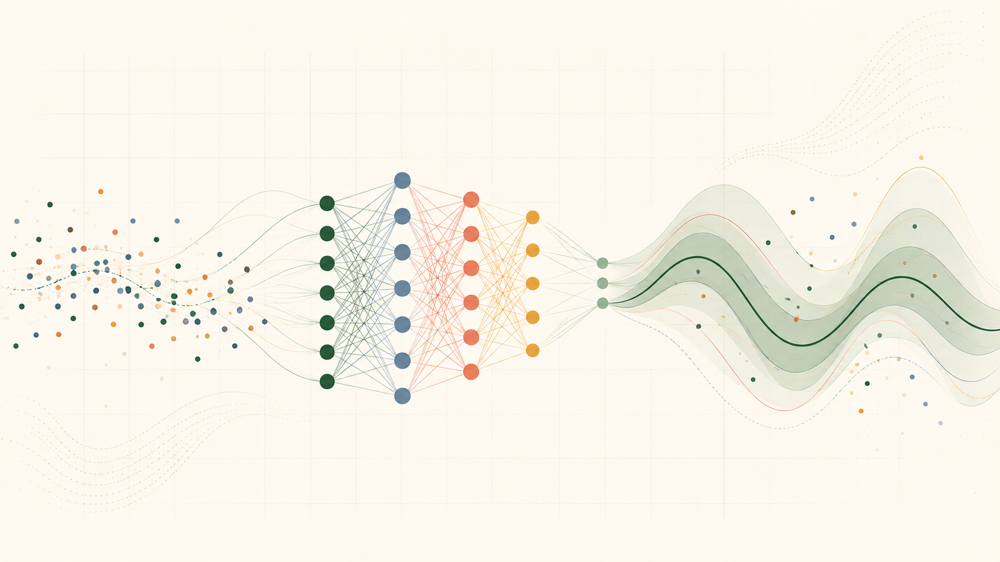

AI for Statistical Learning work is organized by assignment under each week, with each assignment rendered as a Quarto page and downloadable as a PDF file as soon as it is available.

::: {.course-cover}
{.course-cover-image fig-alt="Observed data flowing through a neural network into probabilistic predictions and uncertainty bands"}

Original AI-generated illustration created for this portfolio with OpenAI ImageGen, 2026.

:::

## Weekly Work

::: {.assignment-grid}
::: {.assignment-card}
::: {.card-meta}
Week 1
:::

### Review of Basics - No Assignment

In this section, we will review the basics needed to understand the course material. The assignments for this week is to go through the lecture materials and watch the video recordings.

[Open the Review](week-01/review/){.btn .btn-outline-primary}

:::

::: {.assignment-card}
::: {.card-meta}
Week 2
:::

### Assignment 1

Optimizing linear regression using distribution theory.

[Open assignment](week-02/assignment-01/){.btn .btn-outline-primary}
:::

::: {.assignment-card}
::: {.card-meta}
Week 3
:::

### Assignment 2

Estimating Australia electricity demand with a Normal distribution model.

[Open assignment](week-03/assignment-02/){.btn .btn-outline-primary}
:::

::: {.assignment-card}
::: {.card-meta}
Week 3
:::

### Assignment 3

Comparing Gaussian, quantile regression, and SPQR estimates for electricity demand.

[Open assignment](week-03/assignment-03/){.btn .btn-outline-primary}
:::

::: {.assignment-card}
::: {.card-meta}
Week 4
:::

### Assignment 4

Uncertainty Quantification. (The weather Dataset)

[Open assignment](week-04/){.btn .btn-outline-primary}
:::

::: {.assignment-card}
::: {.card-meta}
Week 5
:::

### Final Project

Estimation and Uncertainty Quantification of rainfall data. (The weather Dataset)

[Open Report](week-05/){.btn .btn-outline-primary}
[Open PDF](week-05/index.pdf){.btn .btn-outline-primary target="_blank"}
[Open Presentation](week-05/presentation.html){.btn .btn-outline-primary target="_blank"}
:::

:::
