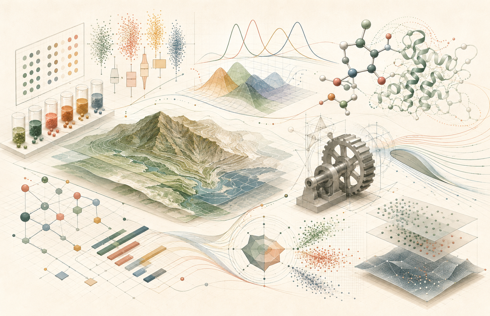

::: {.site-hero .coursework-hero}
::: {.hero-copy}
::: {.hero-kicker}
Coursework hub
:::

## A growing academic library

Course pages come first so new courses, assignments, reports, presentations, and reproducible projects can be added without changing the academic timeline below.

::: {.hero-actions}
[Browse course pages](#course-pages){.btn .btn-primary}
[University of Arkansas](#arkansas){.btn .btn-outline-primary}
[Penn State](#penn-state){.btn .btn-outline-primary}
:::
:::

::: {.hero-visual}
[{.hero-image fig-alt="Interdisciplinary coursework represented by experimental designs, statistical plots, terrain mapping, molecular biology, engineering systems, and multivariate analysis"}](#course-pages)
Click the image to browse the course library.
:::
:::

## Course pages {#course-pages}

Select a course to open its dedicated page. This library is positioned at the top so it can expand as new coursework is added.

### University of Arkansas

::: {.course-library}
<a class="course-link-card" href="courses/agst-50104/">AGST 50104Design of ExperimentsOpen course page →</a>

<a class="course-link-card" href="courses/geos-56503/">GEOS 56503GIS ModelingOpen course page →</a>

<a class="course-link-card featured-course" href="courses/stat-6393v/">STAT 6393VAI for Statistical LearningOpen completed work →</a>

<a class="course-link-card" href="courses/chem-58103/">CHEM 58103Biochemistry IOpen course page →</a>

<a class="course-link-card" href="courses/esrm-64503/">ESRM 64503Applied Multivariate StatsOpen course page →</a>
:::

### Penn State University

::: {.course-library}
<a class="course-link-card" href="courses/stat-500/">STAT 500Applied StatisticsOpen course page →</a>

<a class="course-link-card" href="courses/sweng-545/">SWENG 545Data MiningOpen course page →</a>

<a class="course-link-card" href="courses/ie-575/">IE 575Foundations of Predictive AnalyticsOpen course page →</a>

<a class="course-link-card" href="courses/daan-501/">DAAN 501Research Methodology and Problem FramingOpen course page →</a>

<a class="course-link-card" href="courses/daan-871/">DAAN 871Data Visualization for AnalyticsOpen course page →</a>

<a class="course-link-card" href="courses/sysen-596/">SYSEN 596Independent StudyRole of human mobility in the spread of COVID-19 in the U.S.Open course page →</a>

<a class="course-link-card" href="courses/engmt-501/">ENGMT 501Engineering Management ScienceOpen course page →</a>

<a class="course-link-card" href="courses/engmt-510/">ENGMT 510Economics and Financial Studies for EngineersOpen course page →</a>

<a class="course-link-card" href="courses/sysen-505/">SYSEN 505Technical Project ManagementOpen course page →</a>

<a class="course-link-card" href="courses/sysen-536/">SYSEN 536Decision and Risk Analysis in EngineeringOpen course page →</a>

<a class="course-link-card" href="courses/sysen-850/">SYSEN 850Creativity and Problem Solving IOpen course page →</a>

<a class="course-link-card" href="courses/sysen-555/">SYSEN 555Invention and Creative DesignOpen course page →</a>
:::

## Academic timeline

The newest stage appears first. Continue downward to move back through my graduate studies.

### University of Arkansas {#arkansas}

::: {.university-card .university-card-ua}
::: {.university-heading}
::: {.university-mark .coursework-logo-stack}
[{fig-alt="University of Arkansas logo"}](https://www.uark.edu/)
[{fig-alt="University of Arkansas Division of Agriculture Center for Agricultural Data Analytics"}](https://aaes.uada.edu/centers-and-programs/center-for-agricultural-data-analytics/)
[{.fernandeslab-mark fig-alt="FernandesLAB"}](https://fernandeslab.org/){.fernandeslab-logo target="_blank" rel="noopener noreferrer" aria-label="Open the FernandesLAB website in a new tab"}
:::

::: {.university-intro}
#### Ph.D. Program in Cell and Molecular Biology

My current doctoral coursework supports interdisciplinary research connecting biology, quantitative genetics, statistical modeling, and geospatial analysis.
:::
:::

**Courses**

- AGST 50104: Design of Experiments
- GEOS 56503: GIS Modeling
- STAT 6393V: AI for Statistical Learning
- CHEM 58103: Biochemistry I
- ESRM 64503: Applied Multivariate Stats
:::

### Pennsylvania State University {#penn-state}

::: {.university-card .university-card-psu}
### Great Valley School of Graduate Professional Studies

These two completed degree pathways combine engineering leadership, quantitative analysis, and public-health research. The original course-plan details are preserved below, now paired with the visuals used on the Education page.

::: {.degree-grid}
::: {.degree-card}
{.degree-image fig-alt="Engineering drawings, project-planning blocks, and a mechanical component representing engineering management"}

#### Master of Engineering Management

Core courses:

- ENGMT 501: Engineering Management Science
- ENGMT 510: Economics and Financial Studies for Engineers
- SYSEN 505: Technical Project Management
- SYSEN 536: Decision and Risk Analysis in Engineering
- SYSEN 850: Creativity and Problem Solving I
- SYSEN 555: Invention and Creative Design

Elective courses:

- STAT 500: Applied Statistics
- DAAN 871: Data Visualization for Analytics
- SWENG 545: Data Mining
- SYSEN 596: Independent Study, Role of human mobility in the spread of COVID-19 in the U.S.

Professional master capstone project:

- ENGMT 539: Capstone project course
:::

::: {.degree-card}
{.degree-image fig-alt="Analytical workspace with statistical plots and network visualizations representing data analytics research"}

#### Master of Science in Data Analytics

Core courses:

- STAT 500: Applied Statistics
- SWENG 545: Data Mining
- IE 575: Foundations of Predictive Analytics
- DAAN 501: Research Methodology and Problem Framing
- DAAN 570: Deep Learning

Elective courses:

- SYSEN 862: Analytics Programming in Python
- SYSEN 536: Decision and Risk Analysis in Engineering
- DAAN 871: Data Visualization for Analytics

Master of Science thesis:

- DAAN 600: MS Thesis Research
:::
:::
:::

## Sources and image credits

1. [University of Arkansas Graduate Catalog — Courses of Instruction](https://catalog.uark.edu/graduatecatalog/coursesofinstruction/)
2. [UADA — Center for Agricultural Data Analytics](https://aaes.uada.edu/centers-and-programs/center-for-agricultural-data-analytics/)
3. [Penn State Great Valley — Academic Programs](https://greatvalley.psu.edu/academics)
4. [Penn State Great Valley — Data Analytics](https://greatvalley.psu.edu/academics/masters-degrees/data-analytics)
5. Course selections and degree-plan details are based on academic information supplied by Elias Mohellebi.
6. The three illustrations on this page are original AI-generated artwork created for this portfolio with OpenAI ImageGen in 2026.
7. Statistical figures within course reports are original outputs produced by the author. The Australian electricity-demand data is distributed with the [`qgam` R package](https://cran.r-project.org/package=qgam).
8. The weather data file was supplied for the STAT 6393V course assignments; its upstream publisher is not identified in the retained course files, so no more specific attribution is claimed.
9. Principal software sources: [`cito`](https://cran.r-project.org/package=cito), [`torch`](https://cran.r-project.org/package=torch), and [`qgam`](https://cran.r-project.org/package=qgam) on CRAN, plus the [`SPQR` project](https://github.com/stevengxu/SPQR).
10. [FernandesLAB](https://fernandeslab.org/)
11. [Complete site image credits and information provenance](../sources/)

::: {.page-next}
**Next:** [Research →](../research-work/)
:::
