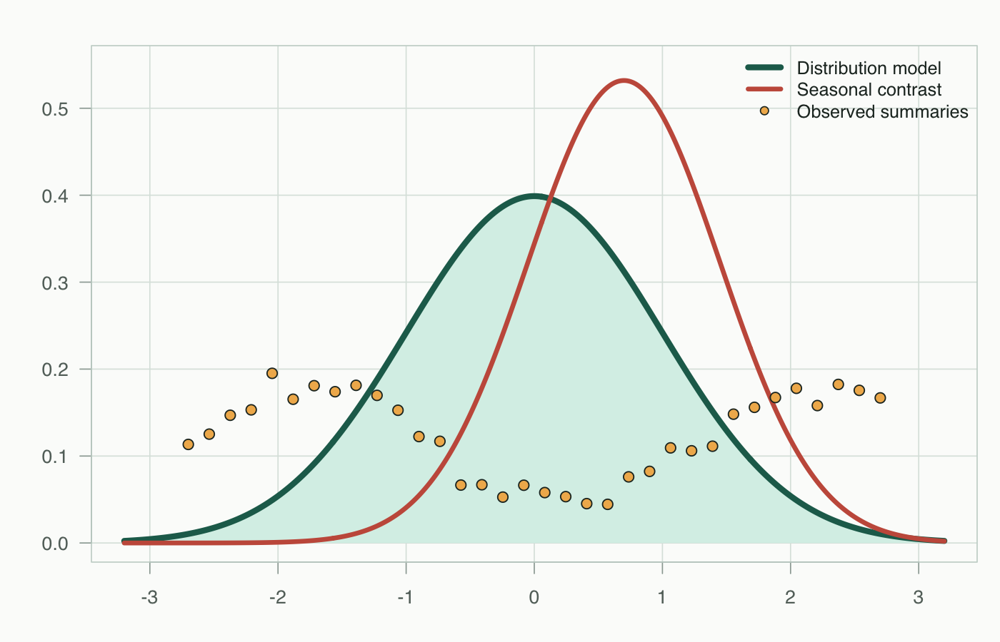

::: {.site-hero}
::: {.hero-copy}
::: {.hero-kicker}
Academic project hub
:::

## Statistical modeling, reports, and reproducible coursework

This site collects rendered Quarto reports for applied statistics coursework. The published version is built from the same source files in this repository, so local rendering and the online site stay aligned.

::: {.hero-actions}
[Open STAT 6393V](STAT6393V/){.btn .btn-primary}
[View source](https://github.com/emohellebi/emohellebi.github.io){.btn .btn-outline-primary}
:::
:::

::: {.hero-visual}
{.hero-image fig-alt="A statistics-themed visualization with distribution curves, grid lines, and observed summary points."}
:::
:::

## Courses

::: {.content-grid}
::: {.content-card}
### STAT 6393V

Applied statistical learning assignments and reports, including likelihood-based estimation, neural-network distribution models, and quantile comparisons.

[Open course page](STAT6393V/){.btn .btn-outline-primary}
:::
:::
