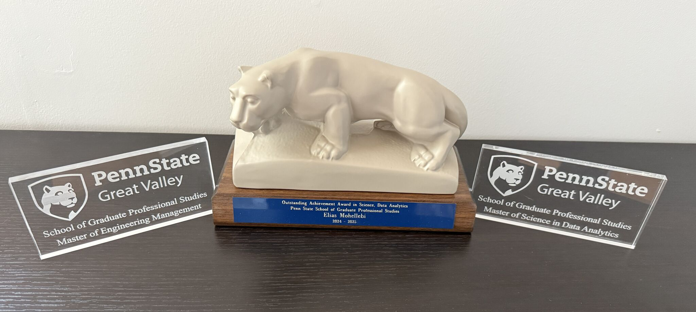
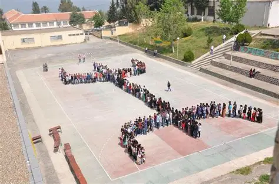
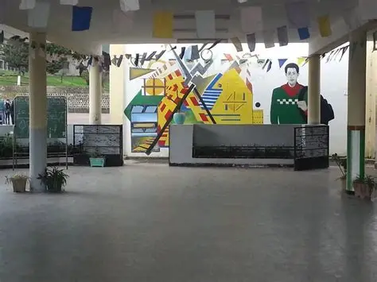

::: {.site-hero .education-hero}
::: {.hero-copy}
::: {.hero-kicker}
Education & academic journey
:::

## Engineering foundations. Analytical depth. Research direction.

My education connects mechanical engineering, technical management, data analytics, public-health research, and biological research. Each stage has expanded the way I frame complex problems—from physical systems and organizational decisions to infectious-disease modeling, machine learning, quantitative genetics, and agricultural data.

::: {.hero-actions}
[Current doctoral work](#arkansas){.btn .btn-primary}
[Graduate degrees](#penn-state){.btn .btn-outline-primary}
:::
:::

::: {.hero-visual .education-path aria-label="Education path"}

Academic path

<strong>Doctoral Research</strong>Cell and Molecular Biology · University of Arkansas

<strong>Master's Studies</strong>Engineering Management · Data Analytics · Public Health Research

<strong>Bachelor's & Master's</strong>Mechanical Engineering · UMMTO

<strong>High School</strong>Mathematics · Chihani Bachir

:::
:::

## Current chapter {#arkansas}

::: {.arkansas-feature}
::: {.institution-lockup}
[{fig-alt="University of Arkansas"}](https://www.uark.edu/)
[{fig-alt="University of Arkansas Division of Agriculture Center for Agricultural Data Analytics"}](https://aaes.uada.edu/centers-and-programs/center-for-agricultural-data-analytics/)
[{.fernandeslab-mark fig-alt="FernandesLAB"}](https://fernandeslab.org/){.fernandeslab-logo target="_blank" rel="noopener noreferrer" aria-label="Open the FernandesLAB website in a new tab"}
:::

::: {.arkansas-copy}

### Doctoral studies and agricultural data science

**Ph.D. student · 2025–present**

At the University of Arkansas, my interdisciplinary doctoral training brings together cell and molecular biology, quantitative genetics, statistical genomics, and computational modeling. My research interests include genotype-by-environment prediction, machine and deep learning, feature engineering, geospatial analysis, and data curation.

I am a member of [FernandesLAB](https://fernandeslab.org/) and the [Center for Agricultural Data Analytics team](https://aaes.uada.edu/centers-and-programs/center-for-agricultural-data-analytics/cada-team/), contributing to a collaborative environment that advances data science across agriculture and the life sciences.
:::

::: {.arkansas-focus}

Current focus

- Quantitative genetics
- Statistical genomics
- Genotype × environment prediction
- Machine and deep learning
- Geospatial modeling
:::
:::

## Penn State graduate education {#penn-state}

I completed a concurrent graduate-degree pathway at Penn State Great Valley, combining the decision and leadership perspective of engineering management with research-intensive training in data analytics. Alongside my studies, I served as a **Graduate Research Associate**, conducting public-health research on infectious-disease vulnerability, human mobility, epidemic simulation, vaccine sentiment, and data-informed interventions.

<!-- TODO: Link the public-health research summary above to its dedicated section after the Research page is redesigned. -->

::: {.psu-banner}
{fig-alt="Penn State logo"}

<strong>Penn State Great Valley</strong>School of Graduate Professional Studies · Malvern, Pennsylvania

:::

::: {.masters-grid}
::: {.masters-card .engineering-degree}
{.masters-image fig-alt="Engineering drawings, project-planning blocks, and a mechanical component representing engineering management"}

::: {.degree-body}

Master of Engineering Management

### Managing technical systems and decisions

<strong>Completed</strong> August 2022<strong>GPA</strong> 3.94

The program strengthened my ability to connect engineering analysis with project leadership, economics, risk, creativity, and strategic decision-making.

**Selected areas**

- Engineering management science
- Economics and financial studies
- Technical project management
- Decision and risk analysis
- Creativity, invention, and design
- Applied statistics and data visualization

**Capstone:** *Recommendations for Strategic Improvement of Tesla, Inc.*

[Explore the official program](https://greatvalley.psu.edu/academics/masters-degrees/engineering-management){.degree-link}
:::
:::

::: {.masters-card .analytics-degree}
{.masters-image fig-alt="Analytical workspace with statistical plots and network visualizations representing data analytics research"}

::: {.degree-body}

Master of Science in Data Analytics

### Turning complex data into research insight

<strong>Completed</strong> March 2025<strong>GPA</strong> 3.96

This research-focused degree developed my foundation in statistics, predictive analytics, machine learning, deep learning, visualization, and reproducible research. I applied those methods to public-health questions, particularly the spread and mitigation of infectious diseases.

**Selected areas**

- Applied statistics and predictive analytics
- Research methodology and problem framing
- Data mining and deep learning
- Analytics programming in Python
- Data visualization and risk analysis

**Thesis:** [*A Machine Learning Framework for Optimizing Travel Restriction Interventions in Response to Infectious Disease Outbreaks*](https://etda.libraries.psu.edu/catalog/34903ekm5533)

[Explore the official program](https://greatvalley.psu.edu/academics/masters-degrees/data-analytics){.degree-link}
:::
:::
:::

::: {.recognition-feature}
::: {.recognition-copy}

2025 graduate recognition

### Two distinct honors

::: {.award-list}
::: {.award-card}
01

#### Outstanding Achievement in Master of Science in Data Analytics
:::

::: {.award-card}
02

#### Hankin Engineering Award and Scholarship for Graduate Student Outstanding Achievement in Engineering
:::
:::
:::

::: {.recognition-photo}
{fig-alt="Penn State Great Valley award displays and Nittany Lion statue recognizing two distinct graduate honors"}
:::
:::

## Engineering foundation {#ummto}

::: {.earlier-school .ummto-school}
::: {.school-gallery}
{fig-alt="Université Mouloud Mammeri de Tizi Ouzou"}
:::

::: {.school-copy}
{.school-logo fig-alt="Université Mouloud Mammeri de Tizi Ouzou logo"}

### Université Mouloud Mammeri de Tizi Ouzou

My university education established the mechanical-engineering foundation that continues to shape my systems thinking and analytical work.

- M.S. in Mechanical Engineering (Energetics)
- B.S. in Mechanical Engineering
- Engineer in Mechanical Engineering, completed October 2009

My capstone research examined the Magnus effect produced by fluid flow around a rotating body. My international mechanical-engineering credentials were subsequently evaluated by World Education Services.
:::
:::

## Academic foundation

::: {.earlier-school .high-school}
::: {.school-gallery .school-gallery-pair}
{fig-alt="Students forming the outline of Algeria at Chihani Bachir High School"}
{fig-alt="Covered courtyard at Chihani Bachir High School"}
:::

::: {.school-copy}

Azazga · Tizi Ouzou · Algeria

### Chihani Bachir High School

**High School Certificate · Mathematics · June 2004**

This mathematics-centered education built the quantitative base for my later studies in engineering, statistics, and data science.
:::
:::

## References

1. [Penn State Great Valley — Master of Engineering Management](https://greatvalley.psu.edu/academics/masters-degrees/engineering-management)
2. [Penn State Great Valley — Master's Degree Options in Data Analytics](https://greatvalley.psu.edu/academics/masters-degrees/data-analytics)
3. [Penn State Electronic Theses and Dissertations — Elias Mohellebi](https://etda.libraries.psu.edu/catalog/34903ekm5533)
4. [University of Arkansas — Crop, Soil, and Environmental Sciences graduate students](https://crop-soil-environmental-sciences.uark.edu/people/graduate-students.php)
5. [UADA — Center for Agricultural Data Analytics team](https://aaes.uada.edu/centers-and-programs/center-for-agricultural-data-analytics/cada-team/)
6. [University of Arkansas — Brand and Style Guidelines](https://brand.uark.edu/)
7. [Penn State — University Mark and Shield](https://brand.psu.edu/visual-identity-standards/university-mark-and-shield)
8. The two degree illustrations are original AI-generated artwork created for this portfolio with OpenAI ImageGen in 2026.
9. The awards, UMMTO, and high-school photographs were supplied directly by Elias Mohellebi from his personal materials.
10. [FernandesLAB](https://fernandeslab.org/)
11. [Complete site image credits and information provenance](../../sources/)

::: {.page-next}
**Next:** [Work Experience →](../work-experience/)
:::
