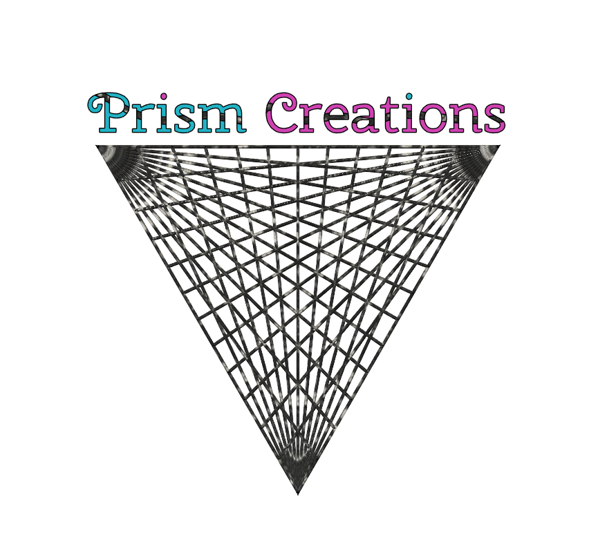
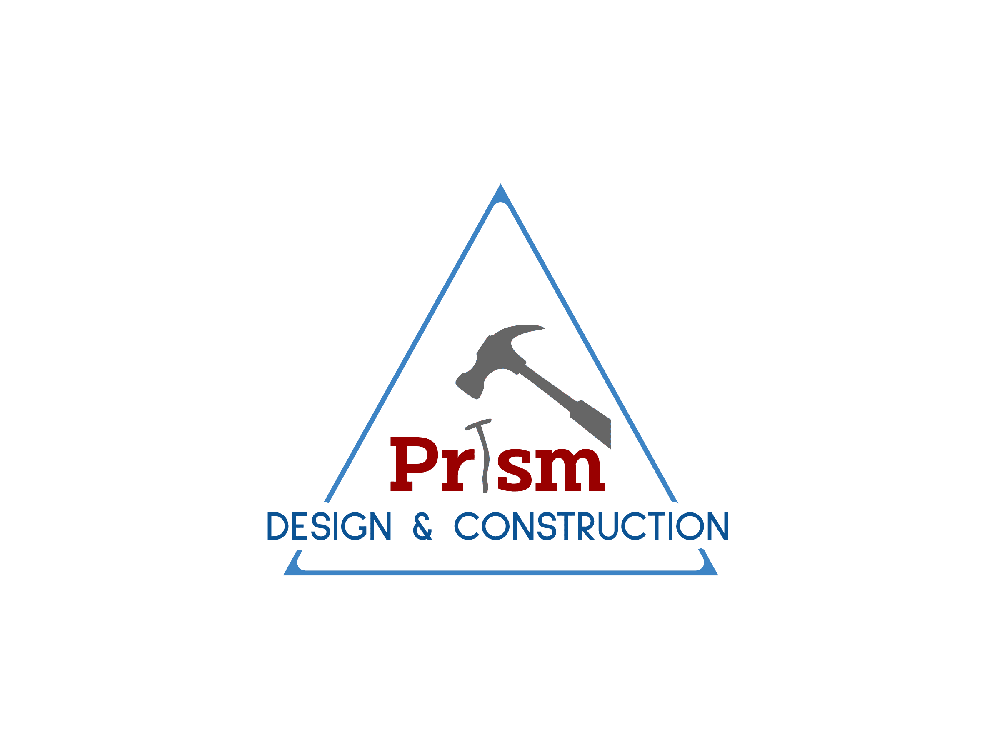
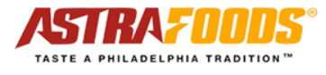
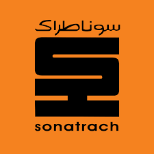

::: {.site-hero .work-hero}
::: {.hero-copy}
::: {.hero-kicker}
Professional experience
:::

## Building systems, teams, and evidence-based solutions

My professional path spans agricultural data science, public-health research, small-business ownership, logistics, manufacturing, construction, and oil-and-gas infrastructure. Across these settings, the common thread is practical problem-solving: organizing complex work, improving systems, and turning technical information into action.

::: {.hero-actions}
[Current research](#current-research){.btn .btn-primary}
[Explore the timeline](#experience){.btn .btn-outline-primary}
:::
:::

::: {.hero-visual .work-path aria-label="Professional path"}

Professional path

<strong>Agricultural Data Science</strong>University of Arkansas · UADA–CADA

<strong>Public-Health Research</strong>Penn State Great Valley

<strong>Entrepreneurship</strong>Three Prism ventures

<strong>Operations & Manufacturing</strong>Transportation · Food production

<strong>Engineering & Oil and Gas</strong>Construction · ENGTP–SONATRACH

:::
:::

## Current research {#current-research}

::: {.experience-card .featured-experience .arkansas-experience}
::: {.experience-logo-row}
[{fig-alt="University of Arkansas"}](https://www.uark.edu/)
[{fig-alt="University of Arkansas Division of Agriculture Center for Agricultural Data Analytics"}](https://aaes.uada.edu/centers-and-programs/center-for-agricultural-data-analytics/)
[{.fernandeslab-mark fig-alt="FernandesLAB"}](https://fernandeslab.org/){.fernandeslab-logo target="_blank" rel="noopener noreferrer" aria-label="Open the FernandesLAB website in a new tab"}
:::

::: {.experience-heading}

Agricultural data science
<h3>University of Arkansas · UADA–CADA</h3>

<strong>Senior Graduate Assistant</strong>2025–present

:::

My current work connects quantitative genetics, statistical genomics, machine learning, deep learning, geospatial analysis, and genotype-by-environment prediction. As a member of [FernandesLAB](https://fernandeslab.org/) and the [CADA team](https://aaes.uada.edu/centers-and-programs/center-for-agricultural-data-analytics/cada-team/), I contribute to collaborative data-science research across agriculture and the life sciences.

View research focus

- High-dimensional data analysis and feature engineering
- Machine- and deep-learning frameworks
- Genotype × environment prediction
- Environmental covariates and geospatial modeling
- Research data curation and reproducible analysis

:::

## Experience {#experience}

::: {.experience-card .featured-experience .penn-state-experience}
::: {.experience-logo-row .single-logo}
[{fig-alt="Penn State"}](https://greatvalley.psu.edu/)
:::

::: {.experience-heading}

Public-health research
<h3>Penn State Great Valley</h3>

<strong>Graduate Research Associate</strong>February 2021–2025

:::

Conducted interdisciplinary public-health research using statistical modeling, human-mobility data, agent-based simulation, machine learning, and sentiment analysis to study infectious-disease vulnerability and response strategies.

<!-- TODO: Link this experience to the dedicated Penn State public-health research section after the Research page is redesigned. -->

View research portfolio

- Developed population-vulnerability measures for infectious-disease spread in metropolitan areas using medical, social, economic, demographic, and transportation factors
- Integrated human mobility into epidemic-vulnerability measures to support strategic planning and resource allocation
- Designed factorial experiments for agent-based simulations of infectious-disease spread
- Investigated the role of human mobility in the spread of COVID-19 across the United States
- Developed a machine-learning framework for recommending travel restrictions intended to reduce deaths and delay peak mortality during epidemics
- Conducted sentiment analysis of public opinion toward COVID-19 vaccines
- Contributed to a framework for assessing the impact of artificial intelligence on job markets

:::

## Entrepreneurship

These ventures developed my experience in ownership, operations, customer service, planning, and hands-on delivery. For the two businesses founded with my wife, **Co-founder & Co-owner** recognizes the shared nature of the work clearly and professionally.

::: {.venture-grid}
::: {.experience-card .venture-card}
::: {.experience-logo-box}
{fig-alt="Prism logo"}
:::

Transportation & logistics

### Prism Transportation & Delivery, Inc.

<strong>Owner</strong>May 2018–June 2020

Managed multi-region delivery operations serving Pennsylvania, New Jersey, and Delaware.

View responsibilities

- Provided delivery services for Staples and managed daily operations across four delivery regions
- Created time-saving loading methods and route-mapping practices
- Hired and trained drivers to meet delivery guidelines and customer-service expectations

:::

::: {.experience-card .venture-card}
::: {.experience-logo-box .prism-creations-logo}
{fig-alt="Prism Creations logo"}
:::

Small-business venture

### Prism Creations, LLC

<strong>Co-founder & Co-owner</strong>

Co-founded and operated with my wife as a shared entrepreneurial venture.

About this venture

The business dates, services, and principal responsibilities will be added once the final details are confirmed.

:::

::: {.experience-card .venture-card}
::: {.experience-logo-box .prism-design-logo}
{fig-alt="Prism Design and Construction logo"}
:::

Design & construction

### Prism Design and Construction

<strong>Co-founder & Co-owner</strong>

Co-founded and operated with my wife, drawing on engineering, design, project-planning, and business-management experience.

About this venture

The business dates, service scope, and principal responsibilities will be added once the final details are confirmed.

:::
:::

## Operations and manufacturing

::: {.experience-card .standard-experience}
::: {.experience-logo-box .wide-logo}
{fig-alt="Astra Foods logo"}
:::

::: {.experience-heading}

Food manufacturing
<h3>Astra Foods</h3>

<strong>Maintenance Technician</strong>January–March 2018

:::

Maintained production equipment in a high-throughput food-manufacturing environment.

View responsibilities

- Inspected, diagnosed, and performed preventive and corrective maintenance on pneumatic and hydraulic equipment to minimize production interruptions
- Rebuilt machines and replaced damaged components, reducing costs compared with full equipment replacement

:::

## Engineering and oil & gas

::: {.experience-card .standard-experience .oil-gas-experience}
::: {.experience-logo-row .oil-gas-logos}
[{fig-alt="ENGTP logo"}](https://www.engtp.com/)
[{fig-alt="SONATRACH logo"}](https://sonatrach.com/)
:::

::: {.experience-heading}

Oil, gas & industrial construction
<h3>ENGTP–SONATRACH</h3>

<strong>Progressive engineering leadership</strong>April 2011–December 2015

:::

Progressed through engineering, procurement, and planning leadership roles supporting pipelines, refineries, storage facilities, and industrial infrastructure across Algeria.

Planning Manager · November 2013–December 2015

- Planned, scheduled, and managed 13 concurrent projects in southeastern Algeria, including pipelines, refinery construction, oil-storage tanks, and related infrastructure
- Introduced Oracle Primavera P6 to improve activity visibility and project control
- Coordinated daily pipeline-manufacturing activity for a workforce of approximately 300 and developed strategies to improve weekly production progress

Deputy Engineering & Procurement Director · June 2012–November 2013

- Coordinated engineering and procurement departments under the company's ISO 9001 quality-management system
- Standardized client communication, cost-estimation, planning, scheduling, and documentation practices
- Managed project coordinators and project managers while resolving competing priorities
- Launched procurement-cost and blueprint database initiatives to preserve records and improve access to historical project information

Engineering & Procurement Manager · April 2011–August 2012

- Managed multidisciplinary teams delivering pipelines, oil-storage tanks, firefighting systems, public facilities, and agricultural infrastructure
- Improved cost-estimation spreadsheets and introduced MS Project for safer, more responsive project planning
- Developed a faster offer–counteroffer process for contract negotiations
- Conducted regular site visits to identify problems early and reduce costly corrective work

:::

::: {.experience-card .standard-experience}
::: {.experience-monogram .engineering-monogram aria-label="EURL Sahnoune Construction Company monogram"}
ES
:::

::: {.experience-heading}

Construction engineering
<h3>EURL Sahnoune Construction Company</h3>

<strong>Mechanical Engineer</strong>November 2009–March 2011

:::

Applied mechanical engineering, CAD, site supervision, and maintenance skills across community and remote-infrastructure projects.

View responsibilities

- Designed CAD plans for public walkways, water towers, and community projects
- Proposed solar panels, solar water heaters, and septic solutions for isolated construction sites in the Algerian Sahara
- Interpreted government requirements and verified compliance with applicable codes and standards
- Supervised job sites and crews to keep construction aligned with project plans
- Performed preventive maintenance on vehicles and equipment to control operating costs

:::

## References

1. [University of Arkansas Division of Agriculture — Center for Agricultural Data Analytics](https://aaes.uada.edu/centers-and-programs/center-for-agricultural-data-analytics/)
2. [Penn State Great Valley](https://greatvalley.psu.edu/)
3. [ENGTP — Entreprise Nationale de Grands Travaux Pétroliers](https://www.engtp.com/)
4. [Astra Foods](https://www.astrafoods.com/)
5. [SONATRACH](https://sonatrach.com/en/)
6. [University of Arkansas — Brand and Style Guidelines](https://brand.uark.edu/)
7. [Penn State — University Mark and Shield](https://brand.psu.edu/visual-identity-standards/university-mark-and-shield)
8. Professional-history information and Prism business logos were supplied directly by Elias Mohellebi.
9. [FernandesLAB](https://fernandeslab.org/)
10. [Complete site image credits and information provenance](../../sources/)

::: {.page-next}
**Next:** [Skills →](../skills/)
:::
