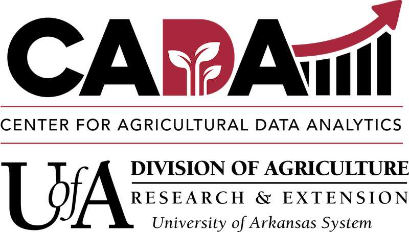

::: {.site-hero}
::: {.hero-copy}
::: {.hero-kicker}
Research Work
:::

## Research projects and themes

My research connects biological variation, environmental context, spatial analysis, public health, human mobility, simulation, and machine learning. The current doctoral chapter at the University of Arkansas builds on the quantitative and interdisciplinary research foundation I developed at Penn State Great Valley.

::: {.hero-actions}
[Doctoral research](#arkansas-research){.btn .btn-primary}
[Penn State research](#penn-state-research){.btn .btn-outline-primary}
[Back to home](../){.btn .btn-outline-primary}
:::
:::

::: {.hero-visual}
::: {.research-focus-panel}

Research focus

<strong>Doctoral Research</strong>Genotype × environment interactions

<strong>Spatial Analysis</strong>Spatial patterns in genotype × environment interactions

<strong>Public Health</strong>Infectious-disease vulnerability

<strong>Human Mobility</strong>Epidemic spread and intervention

<strong>Machine Learning</strong>Prediction and decision support

<strong>Simulation</strong>Factorial design and agent-based models

:::
:::
:::

## University of Arkansas {#arkansas-research}

::: {.doctoral-research-preview}
::: {.institution-lockup}
[{fig-alt="University of Arkansas"}](https://www.uark.edu/)
[{fig-alt="University of Arkansas Division of Agriculture Center for Agricultural Data Analytics"}](https://aaes.uada.edu/centers-and-programs/center-for-agricultural-data-analytics/)
[{.fernandeslab-mark fig-alt="FernandesLAB"}](https://fernandeslab.org/){.fernandeslab-logo target="_blank" rel="noopener noreferrer" aria-label="Open the FernandesLAB website in a new tab"}
:::

Doctoral research · Developing now

### Understanding performance across environments

Within [FernandesLAB](https://fernandeslab.org/), my doctoral research is developing around how genotypes respond differently across environments and how the spatial structure of environments can improve the interpretation and prediction of those responses. Detailed project pages, methods, results, and visualizations will be added as the work progresses.

::: {.research-theme-grid}
::: {.research-theme-card}
01

#### Genotype × Environment Interactions

Studying how genetic differences and environmental conditions combine to influence observed traits and performance.
:::

::: {.research-theme-card}
02

#### Spatial Analysis of Genotype × Environment Interactions

Investigating spatial patterns and environmental relationships that can strengthen genotype-by-environment analysis and prediction.
:::
:::

::: {.coming-soon-note}
**Coming soon:** research questions, data structure, analytical methods, maps, models, and selected findings.
:::
:::

## Penn State University — Great Valley {#penn-state-research}

::: {.content-grid}
::: {.content-card}
### Population vulnerability measures

Population vulnerability to the spread of infectious diseases using medical, social, economic, demographic, and public transportation parameters.

<a class="tableau-preview" href="https://public.tableau.com/app/profile/elias.z.mohellebi/viz/Population_Vulnerability_Measures/VulnerabilityMeasuresinNYC" target="_blank" rel="noopener noreferrer" aria-label="Open Vulnerability Measures in NYC on Tableau Public in a new tab"><small>Interactive Tableau dashboard</small><strong>Vulnerability Measures in NYC</strong><em>Open visualization ↗</em></a>
:::

::: {.content-card}
### Human mobility and epidemic vulnerability

Integrating human mobility into epidemic vulnerability measures in the U.S. to support strategic planning and resources allocation.
:::
:::

::: {.content-grid}
::: {.content-card}
### Design of experiment for COVID-19 scenarios

Design of experiment using factorial designs to simulate the spread of an infectious disease with an agent-based model.
:::

::: {.content-card}
### Role of human mobility in COVID-19 spread

Independent study at PSU-GV proposing equations that describe the spread of COVID-19 to U.S. states using regression methods.
:::
:::

::: {.content-grid}
::: {.content-card}
### Machine learning for travel restrictions

Machine learning capable of recommending travel restrictions to minimize deaths and delay peak mortality during epidemics.
:::

::: {.content-card}
### Sentiment analysis on COVID-19 vaccines

Deep learning work classifying Twitter emotions regarding COVID-19 vaccines.
:::
:::

::: {.content-card}
### AI impact on job markets

A framework for assessing the impact of artificial intelligence on job markets, with a linked Facebook community.
:::

## References and image credit

1. [University of Arkansas](https://www.uark.edu/)
2. [UADA — Center for Agricultural Data Analytics](https://aaes.uada.edu/centers-and-programs/center-for-agricultural-data-analytics/)
3. [UADA — Center for Agricultural Data Analytics team](https://aaes.uada.edu/centers-and-programs/center-for-agricultural-data-analytics/cada-team/)
4. [FernandesLAB](https://fernandeslab.org/)
5. [Tableau Public — Population Vulnerability Measures: Vulnerability Measures in NYC](https://public.tableau.com/app/profile/elias.z.mohellebi/viz/Population_Vulnerability_Measures/VulnerabilityMeasuresinNYC)
6. [Tableau — official website and logo source](https://www.tableau.com/)
7. [Penn State Great Valley](https://greatvalley.psu.edu/)
8. [Penn State thesis record — Elias Mohellebi](https://etda.libraries.psu.edu/catalog/34903ekm5533)
9. Research-history and project-summary information was supplied directly by Elias Mohellebi.
10. [Complete site image credits and information provenance](../sources/)
